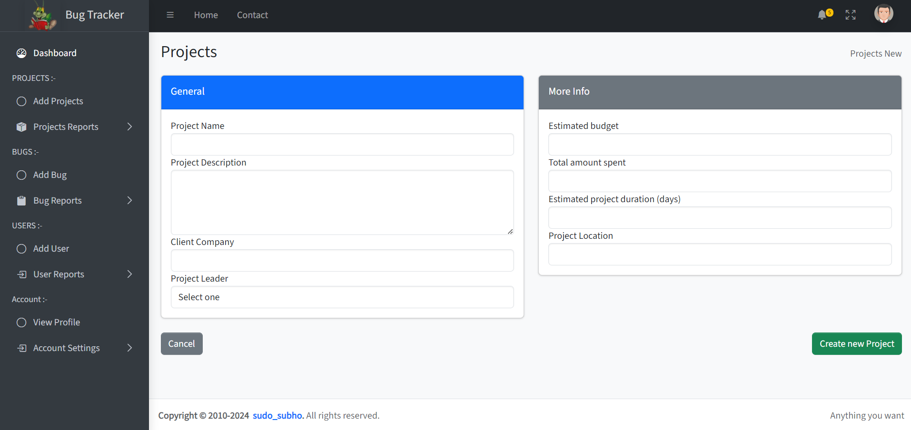
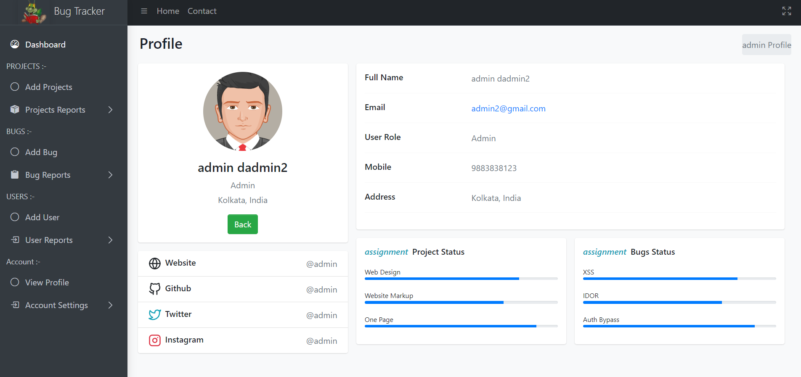

# BugTracker
bugTracker is a comprehensive web application designed to streamline the process of tracking and managing software bugs and issues within development teams. Built with modern web technologies, bugTracker offers a user-friendly interface and robust functionality to enhance collaboration and efficiency in software development projects.

# Install:

// Download all requirements and cd to the folder

```python manage.py runserver```

// Default user and password is admin:admin 

// Admin panel link is HTTP://127.0.0.1:8000/admin

# Pics:

### Home


### Adding Projects and bugs



### Poject and bug list


### Profile 


